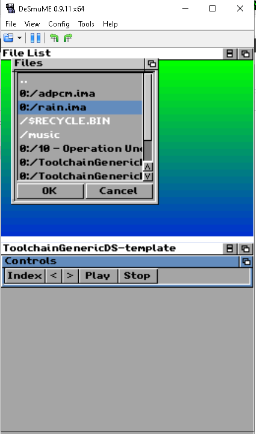

NTR/TWL SDK: TGDS1.65

master: Development branch. Use TGDS1.65: branch for stable features.

This is the ToolchainGenericDS Woopsi template project:

1.	Compile Toolchain:
To compile this project you will need to follow the steps at https://bitbucket.org/Coto88/toolchaingenericds :
Then simply extract the project somewhere.

2.	Compile this project: 
Open msys, through msys commands head to the directory your extracted this project.
Then write:
make clean <enter>
make <enter>

After compiling, run the example in NDS. 

Project Specific description:
A Woopsi UI + TGDS SDK template for UI control handling on the NintendoDS. 
Draw the pop up windows across the screen or scroll other windows to test touchscreen. 
- Also plays WAV/AD-PCM (Intel) files from the directory!
- Also boots NDS homebrew!

Note: UI Controls experimental.

/release/arm7dldi-ntr contents:
	- ToolchainGenericDS-template.nds: This homebrew; also known as TGDS Host App.
	
	- TGDS-lm-template.bin: ARM9 reloadable binary, implements https://bitbucket.org/Coto88/toolchaingenericds-linkedmodule/src
	Usage: run TGDS project first, then reload it through the menu (either console or Woopsi UI), a new TGDS-LinkedModule ARM9 binary will reload. 
	Read TGDS-LM program how to go back into TGDS Host App.
	
	- tgds_multiboot_payload.bin: TGDS-multiboot payload, allows to run NDS homebrew, requires by TGDS Host App.

Latest stable release: https://bitbucket.org/Coto88/ToolchainGenericDS-template/get/TGDS1.65.zip

Coto